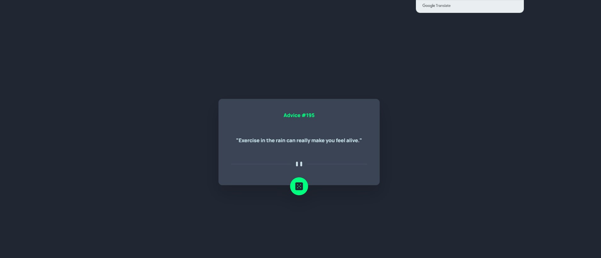

Users should be able to:

- View the optimal layout for the app depending on their device's screen size
- See hover states for all interactive elements on the page
- Generate a new piece of advice by clicking the dice icon

### Links
- Solution URL:
- Live Site URL:

### Built with

- NextJS
- TypeScript
- Tailwind

## Author
- Website - [Leonardo Amorim](https://www.your-site.com)
- Frontend Mentor - [@LeoAraujoAmorim](https://www.frontendmentor.io/profile/LeoAraujoAmorim)
- GitHub - [@LeoAraujoAmorim](https://github.com/LeoAraujoAmorim)
